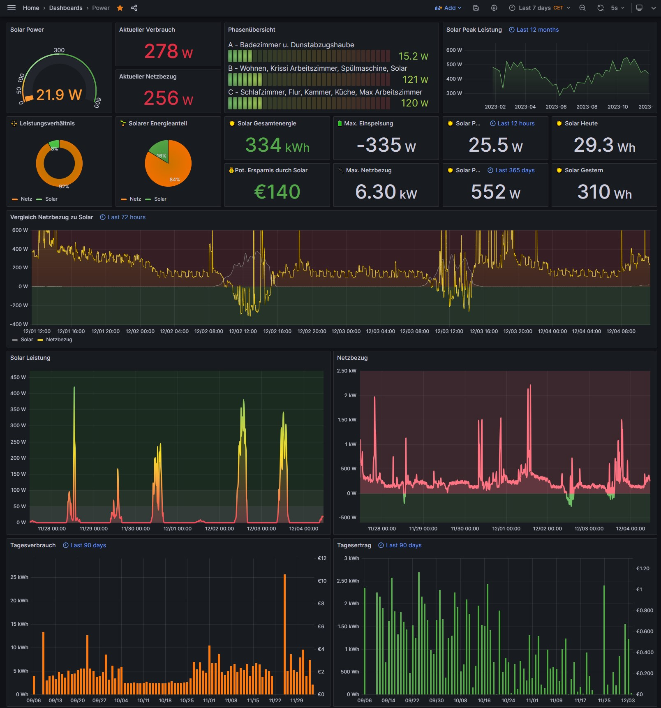

# Power-Tracking

In diesem Artikel möchte ich zeigen, wie ihr euren Stromverbrauch und potentielle Stromerzeugung durch z.B. eine Solaranlage messen und visuell darstellen könnt. Ich verwende in meinem Aufbau zwei Smart-Meter mit MQTT Funktion. Aufgrund der großen Anzahl an Anleitungen im Internet, werde ich keine Einzelschrittanweisungen geben, sondern mehr den Gesamtaufbau darstellen und nützliche Links beifügen. In meinem Setup messe ich sowohl den Gesamtverbrauch der Wohnung, als auch die abgegebene Energie und Leistung meiner Balkon-Solaranlage.

## Hardwareaufbau | Layout

## Shelly 1PM

Zur Messung der Energie und Leistung, die von der Solaranlage in das Hausnetz abgegeben wird, habe ich die Balkonsteckdose über einen Shelly 1PM gebrückt. Typischerweise hat eine Steckdose am Balkon einen innenliegenden Lichtschalter, über den man die Außensteckdose Ein- und Ausschalten kann. Da die Solaranlage nicht durch einen versehentlichen Tastendruck ausgeschaltet werden soll, empfehle ich das Lichtschalter-Modul zu entfernen und den Shelly 1PM in der Unterputzdose einzubauen. Die Blende des Lichtschalters kann anschließend mit einem leicht löslichen Kleber sparsam in der Fassung eingeklebt werden. Somit ist ein Rückbau problemlos möglich.

## Shelly 3EM

Um den gesamten Hausstrom zu überwachen, ist es erforderlich ein Smart-Meter in die Unterverteilung einzubauen. Eine gering-invasive Lösung ist hier der Shelly 3EM, dessen Strommessklemmen um die Einzelphasen der Unterverteilung gesteck werden können. Zur Leistungsberechnung brauchen wir noch die korrespondierenden Einzelspannungen der Phasen, die wir über einen zusätzlichen Sicherungsautomaten absichern. Somit ist keine Änderung der bestehenden Unterverteilung notwendig und ein Rückbau ohne weiteres möglich.

## Computer

Zur Speicherung und Aufbereitung der Messdaten (Smart-Meter) braucht es einen Computer. Für einfaches Power-Tracking sind Linux basierte Computer wie ein Raspberry Pi völlig ausreichend. Wer tiefer in die Materie einsteigen möchte und u.U. auch weitere Projekte realisieren wird, sollte sich für knapp 150 € Aufpreis einen Mini-PC holen. Dieser ist deutlich potenter als beispielsweise ein Raspberry Pi und ist gemessen an der Hardwareleistung verhältnismäßig günstig. An der Stelle sei noch darauf hingewiesen, dass die Shellys über eine Cloud-Schnittstelle verfügen und eine eigene Datenauswertung optional ist.

Ich nutze einen Mini PC von Beelink:

- Intel 12th Processor N100
- 16 GB DDR5
- 500 GB PCIe SSD Mini Computer
- Dual 2.5 GBit LAN
- WiFi 6/BT 5.2

## Software

1. Betriebssystem: Proxmox
1. MQTT Broker: Mosquitto
1. Datenbank: InfluxDB
1. Backend: NodeRED
1. Frontend/ Visualisierung: Grafana

### Betriebssystem

Gerade wenn man neue Lösungen ausprobiert, Sensoren integrieren oder die Konfiguration des Systems anpassen möchte, kann es leicht zu Fehlern kommen. Daher empfehle ich grundsätzlich die Verwendung von Proxmox. Alle Instanzen sind somit in eigenen Containern gekapselt und können isoliert verwaltet werden. [Hier](https://www.youtube.com/watch?v=rj0TZcpmnIs&list=PL3-bM7Aq1pUpSTIQiffrCiR29Z-SCS9wd) findet ihr eine gute Videoreihe zu dem Thema.

### Mosquitto NodeRED und InfluxDB

Nachdem der Mosquitto Server installiert und konfiguriert ist, kann die Serveradresse auf die Smart-Meter übertragen werden. An dieser Stelle empfehle ich das Programm [MQTT Explorer](https://mqtt-explorer.com/), um sicherzustellen, dass die getroffene Konfiguration korrekt ist. Das folgende Bild zeigt meinen Backend-Aufbau in NodeRED. Dieser kann natürlich je nach persönlichen Zielen unterschiedlich ausfallen.

### Grafana

Verknüfen wir nun Grafana mit der InfluxDB können wir unsere Messwerte visuell ansprechend darstellen. Ich empfehle im Grafana Container noch ein [mDNS Service](https://www.avahi.org/) zu installieren, um dann einfach vom PC, Tablet oder Smartphone via `http://grafana.local` auf das Dashboard zugreifen zu können.

